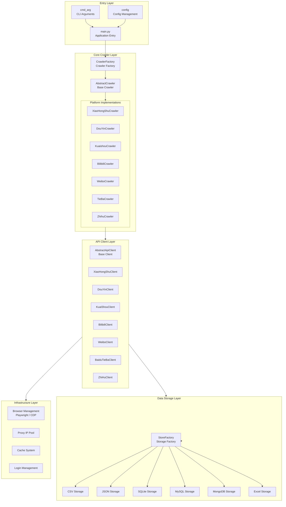
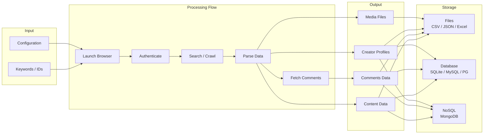
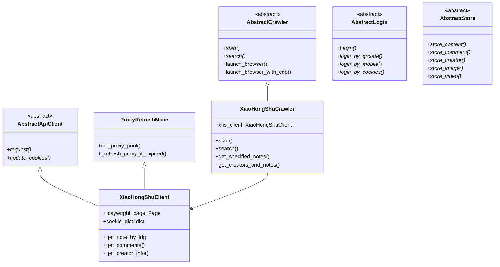

# MediaCrawler Architecture Guide

## 1. Overview

### 1.1 Introduction

MediaCrawler is a multi-platform social media crawling framework built using Python asynchronous programming. It supports scraping contents, comments, and creator profiles across major social media platforms.

### 1.2 Supported Platforms

| Platform | Code | Main Capabilities |
|----------|------|-------------------|
| Xiaohongshu | `xhs` | Note search, note details, creator profiles |
| Douyin | `dy` | Video search, video details, creator profiles |
| Kuaishou | `ks` | Video search, video details, creator profiles |
| Bilibili | `bili` | Video search, video details, UP master profiles |
| Weibo | `wb` | Post search, post details, blogger profiles |
| Baidu Tieba | `tieba` | Post search, post details |
| Zhihu | `zhihu` | Q&A search, answer details, author profiles |

### 1.3 Core Features

- **Multi-Platform Support**: Unified crawler interfaces for 7 major social media platforms.
- **Multiple Login Methods**: QR Code, Mobile SMS, and Cookie authentication.
- **Versatile Storage Options**: CSV, JSON, JSONL, SQLite, MySQL, PostgreSQL, MongoDB, and Excel formats.
- **Anti-Bot Countermeasures**: CDP mode, rotating IP proxy pool, and request signing engines.
- **Asynchronous Concurrency**: Built on `asyncio` for high-throughput concurrent scraping.
- **Word Cloud Generation**: Automated visualization for comment text analysis.

---

## 2. System Architecture

### 2.1 High-Level Architecture



### 2.2 Data Flow



---

## 3. Directory Layout

```
MediaCrawler/
├── main.py                 # Application entry point
├── var.py                  # Global context variables
├── pyproject.toml          # Project configuration & dependencies
│
├── base/                   # Abstract base classes
│   └── base_crawler.py     # Base crawler, login, store, and client definitions
│
├── config/                 # Configuration management
│   ├── base_config.py      # Core crawler settings
│   ├── db_config.py        # Database settings
│   └── {platform}_config.py # Platform-specific settings
│
├── media_platform/         # Platform crawler implementations
│   ├── xhs/                # Xiaohongshu
│   ├── douyin/             # Douyin
│   ├── kuaishou/           # Kuaishou
│   ├── bilibili/           # Bilibili
│   ├── weibo/              # Weibo
│   ├── tieba/              # Baidu Tieba
│   └── zhihu/              # Zhihu
│
├── store/                  # Data storage layer
│   ├── excel_store_base.py # Excel export base
│   └── {platform}/         # Platform-specific storage handlers
│
├── database/               # Relational & NoSQL database models
│   ├── models.py           # SQLAlchemy ORM models
│   ├── db_session.py       # Session management
│   └── mongodb_store_base.py # MongoDB storage base
│
├── proxy/                  # Proxy management
│   ├── proxy_ip_pool.py    # IP pool manager
│   ├── proxy_mixin.py      # Proxy refresh mixin
│   └── providers/          # Third-party proxy vendors (Kuaidaili, Wandou)
│
├── cache/                  # Caching engines
│   ├── abs_cache.py        # Abstract cache base
│   ├── local_cache.py      # Memory-based LRU/TTL cache
│   └── redis_cache.py      # Redis cache
│
├── tools/                  # Utility modules
│   ├── app_runner.py       # Application lifecycle runner
│   ├── browser_launcher.py # Playwright browser launcher
│   ├── cdp_browser.py      # CDP browser manager
│   ├── crawler_util.py     # Helper utilities
│   └── async_file_writer.py # Asynchronous buffered file writer
│
├── model/                  # Data models
│   └── m_{platform}.py     # Pydantic schemas
│
├── libs/                   # JavaScript libraries
│   └── stealth.min.js      # Playwright anti-detection script
│
└── cmd_arg/                # Command line argument parser
    └── arg.py              # CLI definitions
```

---

## 4. Core Class Hierarchy


